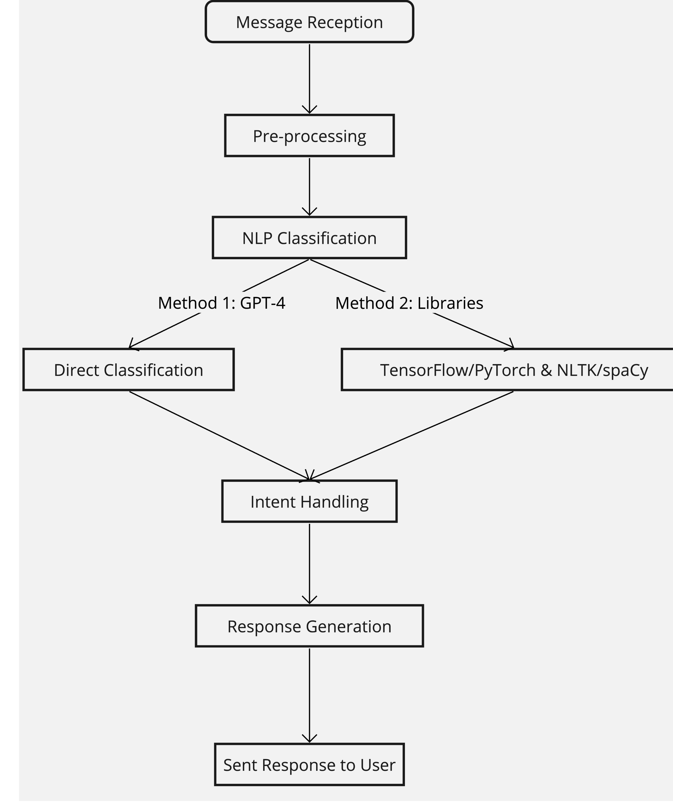

# Engineering

- High Risk Intent Classification
- Data Processing and Message Classification
- Integration with Chat and Messaging Platforms
- Continuous Learning and Model Improvement
- Architecture Overview (Technical Stack, Data Flow, APIs)

Intent Recognition: Turn stacks/Journey to trigger custom webhook
hosting the LLM Chat Bot Application that does classification.

### Development

- Language Model Used
- Which framework was used?
- Data used for RAG
    - How was the data curated?
    - What tests were performed during development?

### Deployment

- Testing performed before deployment

### Evaluation

- Dataset used for evaluation
- Performance of the Language Model (Accuracy, other metrics that we may have)

