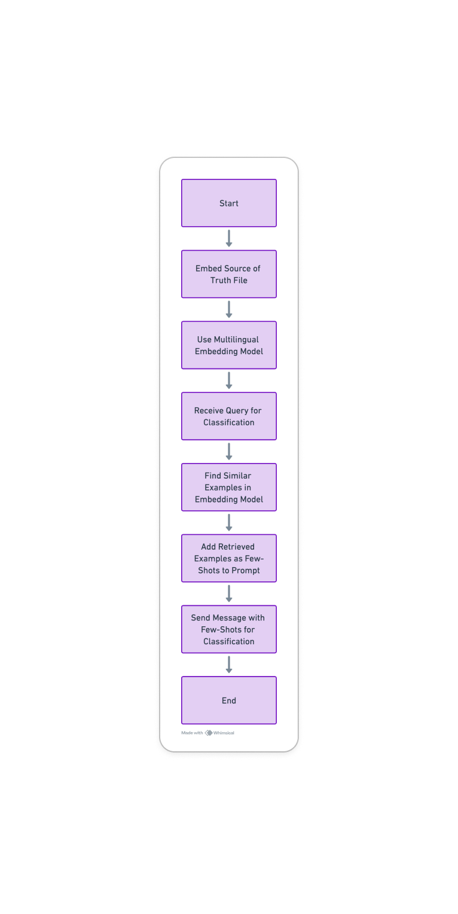

# Development

## Overview

The application uses a Language Model (LLM) with GPT-4 at its core for intent recognition. The process involves embedding input data, utilizing a multilingual model for dynamic example selection, and performing intent classification with a few-shot learning approach. Below are the detailed steps following the flow chart provided.

## Detailed Process Flow

### 1. Embed Source of Truth File

- **Purpose:** Create embeddings for the few-shot examples that serve as the "source of truth."
- **Procedure:** Input the few-shot examples into GPT-4, which generates a vector representation of each example.

### 2. Use Multilingual Embedding Model

- **Functionality:** Facilitate the understanding and processing of messages in multiple languages.
- **Selection:** Dynamically choose the relevant embeddings based on the language and content of the incoming query.

### 3. Receive Query for Classification

- **Reception:** The system accepts an incoming user query that needs to be classified.
- **Pre-processing:** Standardize the query to match the format expected by the model (e.g., lowercasing, removing special characters).

### 4. Find Similar Examples in Embedding Model

- **Search:** Within the multilingual embedding space, identify few-shot examples with high similarity to the received query.
- **Criteria:** Examples are selected based on semantic similarity and language relevance.

### 5. Add Retrieved Examples as Few-Shots to Prompt

- **Integration:** The selected few-shot examples are combined with the query to create a new prompt for GPT-4.
- **Contextualization:** This step ensures that the context for the classification is set correctly, which is particularly important for the few-shot learning approach.

### 6. Send Message with Few-Shots for Classification

- **Classification Request:** The prompt consisting of the query and few-shot examples is fed to GPT-4.
- **GPT-4 Processing:** GPT-4 analyzes the combined input to understand the intent of the query by drawing parallels with the provided few-shot examples.

### 7. Classification

- **Outcome:** GPT-4 outputs the classification of the query's intent.
- **Post-Processing:** The result may then be used to trigger corresponding action handlers or responses within the application.

## Action Handlers and Response Functions

- **Purpose:** Design specific functions/handlers to address common intents such as greetings, feedback, acknowledgments, marking spam, and language preference management.
- **Implementation:**
  - Develop a set of predefined response templates for each intent category.
  - Create a function dispatcher that routes the classified intents to their respective handlers.
- **Database Integration:**
  - Ensure each handler is capable of updating the user's status or preferences in the application's unified database.
  - This update mechanism is crucial for maintaining consistent communication and personalizing the user experience.
- **Dynamic Response Generation:**
  - Integrate with GPT-4 Functions to dynamically generate responses for intents that require more nuanced or context-specific information.

## Additional Technical Considerations

- **Multilingual Capability:** The system must accurately handle and classify queries across different languages, necessitating the use of a robust multilingual model.
- **Dynamic Example Selection:** To accommodate the variability in user queries, the embedding model must be capable of selecting the most appropriate few-shot examples on-the-fly.
- **Few-Shot Learning:** This approach allows the application to effectively classify intents with minimal training data per category, as GPT-4 can generalize from a few examples.

By following these steps, the application leverages the powerful capabilities of GPT-4 for intent recognition, while also ensuring adaptability and accuracy through the use of multilingual embeddings and dynamic few-shot example selection.
