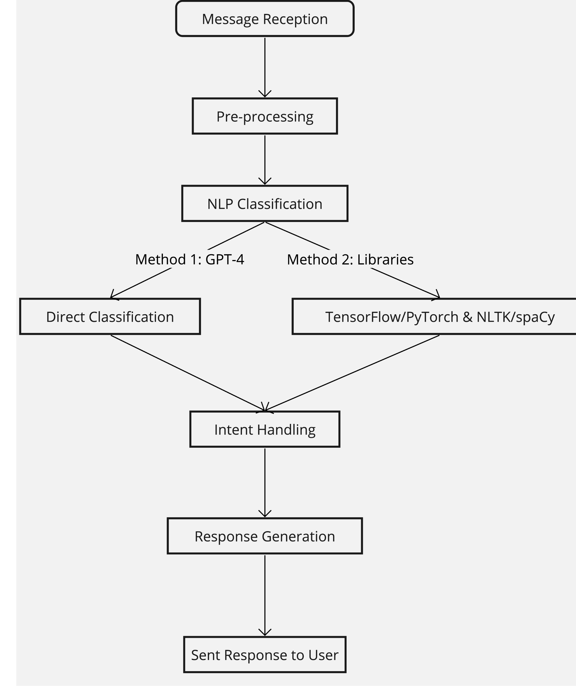
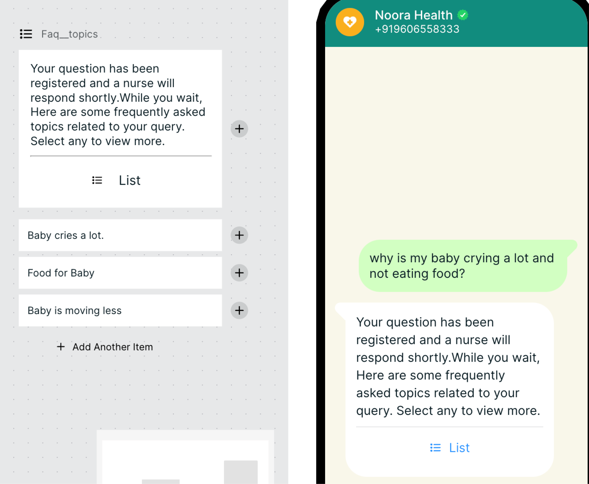

# Development

These are the key engineering divisions that we need to bring together for an improvised intent recognition system:

- High Risk Intent Classification
- Data Processing and Message Classification
- Integration with Chat and Messaging Platforms
- Continuous Learning and Model Improvement

<!--  -->

### System Components

### Message Reception and Pre-processing

Ingestion API: Utilize Python’s Fast API framework to create RESTful APIs that efficiently handle incoming messages from turn’s webhook (or Meta’s cloud business manager.)

Pre-processing Service: Implement a service to sanitize and
standardize messages by removing special characters, converting text to
lowercase, and other necessary pre processing steps to ensure data
quality for NLP/LLM analysis.

### NLP and Machine Learning for Intent Classification:

Intent Recognition: Turn stacks/Journey to trigger custom webhook hosting the LLM Chat Bot Application that does classification.

#### Method 1

Easy and Fast Dev Time but a bit Expensive:

GPT-4 Classification: Leverage GPT-4 for direct message
classification, bypassing the need for a separate translation layer,suitable for straightforward intent recognition tasks.More Dev time but cheaper and less accurate:

##### Method 2

Translation services and NLP Libraries: For multilingual
support, integrate ai4bharat’s transliteration and translation services followed by TensorFlow or PyTorch for machine learning. Use NLP libraries like NLTK or spaCy for additional text processing and classification into predefined intent categories.

Model Training: Employ supervised learning techniques with a
well-labeled dataset containing diverse examples of user messages mapped
to target intent categories.

Model Deployment: Package and deploy the trained model as a
microservice, utilizing Docker for enhanced scalability, portability,
and isolation.

### Action Handlers

Function Dispatcher: A crucial system component responsible for
mapping classified intents to corresponding action handlers, including
integration with GPT-4 Functions for dynamic response generation.

Handlers: Develop specific handlers for common intents such as greetings, feedback, acknowledgments, marking spam, and managing user language preferences. Ensure handlers update the user’s status or preferences in a unified database for consistent communication.

Types: Greetings, Acknowledgments ,Spam, Requests to change language, Medical Questions

### Suggested FAQ:

Semantic based gpt4 retrieval to provide user with suggested FAQ and its answers while the users wait for a medical response.

<!--  -->

### Technical Stack and Tools

Backend and APIs: Build the backend infrastructure using Python,
leveraging Fast API for its asynchronous support and ease of use in
creating RESTful services. NLP/ML Components: Utilize GPT-4 for intent
classification, TensorFlow or PyTorch for building custom ML models, and
NLP libraries such as NLTK or spaCy for text analysis and preprocessing.
Database Management: Implement SQL Alchemy for structured data storage
and intent categorization records. Use Redis for caching frequently
accessed data or responses to enhance system performance. Suggested FAQ:
Whatsapp templates with buttons/list.

### Caveats

When classifying messages received through webhooks, it’s important
to note that this approach may overlook the broader context of
conversations. Specifically, accurate message classification often
necessitates access to the chat history, as some inputs can only be
properly understood and classified within their conversational
context.

Therefore, after establishing a foundational message classification
system, it’s advisable to enhance its accuracy by incorporating the
user’s chat history into the classification process. This integration
will allow for a more nuanced understanding of the messages, leading to
improved classification outcomes.
