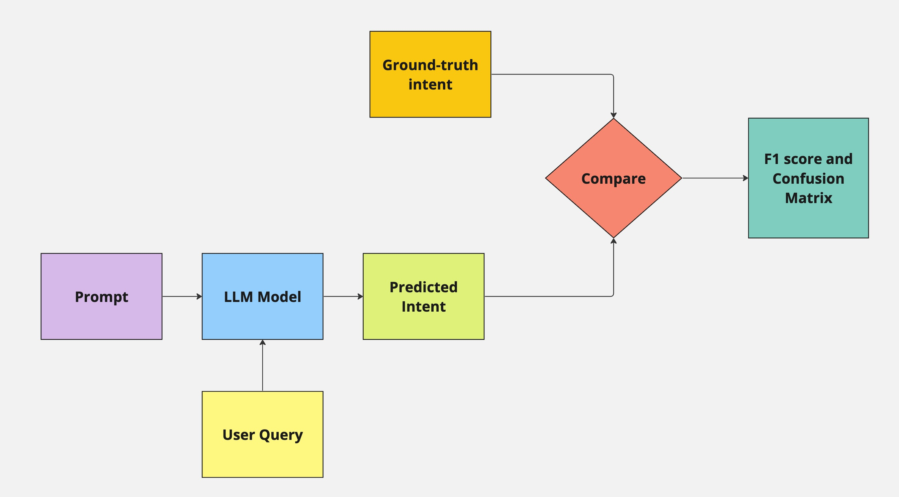

# Evaluation

In this section we desribe our approach of evaluation of the Intent Recognition System.

The broad components that we test in our intent recognition system are shown in the diagram below:



| Label     | Description |
| ----------- | ----------- |
| User query | This is the message sent by the user to our platform and we use this during our qualitative evaluations|
| Predicted Intent     | This is the output of the GPT model given the prompt and the user message as the input |
| Prompt  | The instruction given to the LLM to execute  |
| Ground-truth Intent  | This is the ground-truth intent based on the dataset we have and has been annotated by our in-house Medical Support Executive team |
| Comparison | This is a boolean comparison between the predicted intent and the ground-truth intent|


:::note
A confusion matrix represents the predictive performance of a model on a dataset. For a binary class dataset (which consists of, suppose, “positive” and “negative” classes), a confusion matrix has four essential components: True Positives (TP): Number of samples correctly predicted as “positive.” 
:::

:::note
F1 score is the weighted average of precision and recall. In our analysis, F1 score is more useful than accuracy since the cost of false positives and false negatives are very different.
:::


### Prompt
The first variable in the system is the prompt that we pass to the LLM. The prompts are version controlled, revised over time to produce the best results derived from evaluating the macro F1 score.

Currently our prompt versions are as follows:

#### Version 1
```
Judge the intent of the text input from the following options:

"Acknowledgement",
"Medical",
"Language change request",
"Greeting",
"Spam",
"Other"
```

#### Version 2
```
Classify the Given user's message into one of 6 categories.
1. Acknowledgement,
2. Medical,
3. Language change request,
4. Greeting,
5. Spam,
6. Other

The input message can be in any language. If the language is not english, translate it to english and classify.

{few_shots}

Only output the category
```

#### Version 3
```
Classify the user's message into one of 6 categories.
1. Acknowledgement,
2. Medical,
3. Language change request,
4. Greeting,
5. Spam,
6. Other

If the language is not english, translate it to english and classify.

{few_shots}

Don't explain and only return the category as given above
```

#### Version 4
```
Classify the user's message into one of 6 categories.
1. Acknowledgement,
2. Medical,
3. Language change request,
4. Greeting,
5. Spam,
6. Other

If the language is not english, translate it to english and classify.

Don't explain and only return the category as given abov
```

:::note
To track the changes in the prompts over time, we use Langfuse, an LLM observability tool. Langfuse tracks the versioning of the prompts, including the additions, deletions and modifications to the prompt text. This allows users to see the history of changes made to the prompt over time.
:::

### Large Language Model
We are currently experimenting between GPT-3.5 and GPT-4 and based on our multilingual performance and the cost. A decision on the best model for our use-case is to be taken.


### Evaluation Metrics
We use the Macro F1 score to compare between the various models and prompts. Further, we analyse the results using confusion matrices to determine the false positives and false negatives to get a stronger sense of our model performance.

## Production Test
While the overall strategy mentioned above is a generic testing methodology, as we progress with our deployment, we are aiming to conduct monthly ground-truth exercises. This is aimed at measuring the ground-truth data overriding the automatic classification layer, and using this as a mechanism to measure the overall performance of the model. Once streamlined, this gets standardised as a standard operating procedure.

## Continuous Improvement
Based on our production test results, we will carry out internal tests to further improve our intent recognition system with improved prompt quality or test other off-the-shelf LLMs and observe how they perform with our dataset.

## Qualitative Evaluation
We will also be conducting a qualitative study to understand the benefits and challenges faced by the Medical Support Executives in transitioning to AI-based classification tools
