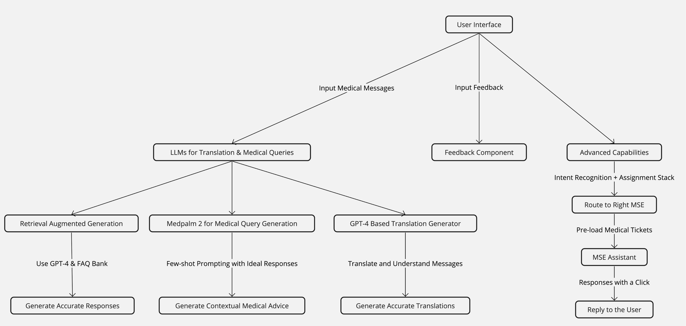
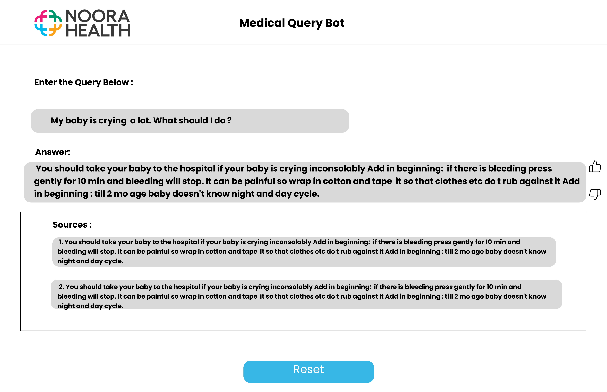
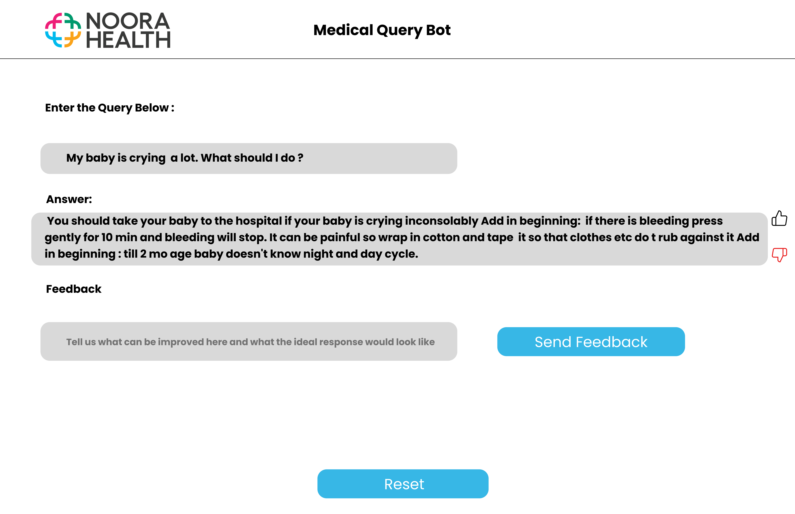

# Development

- Architecture Overview (Technical Stack, Data Flow, APIs): Backend Processing and API Integration,
  Handling and Resolution of Medical Queries
- Translation and Localisation Support
- Performance Optimisation and Scalability

Webapp with a backend on the LLM Chat Bot Application

<!--  -->

### System Components:

### User Interface

A UI for Inputing Medical messages for response generation or translation. This interface should be accessible via web or mobile platforms, offering a seamless experience for users seeking medical information or assistance. Also have a component to input feedback for each query.

Advanced Capabilities: Using the Intent recognition + Assignment stack route the medical message to the right mse in the mse assistant. Pre-load the medical tickets and the MSEs can get responses back with just a click.

### LLMs for Translation and Medical Queries (Two Ways):

Retrieval Augmented Generation: Utilize GPT-4 in conjunction with a curated FAQ bank specifically tailored for medical inquiries. This approach will enable the system to provide accurate and relevant responses by leveraging both the generative capabilities of GPT-4 and
the specific, reliable information contained within the FAQ bank.

Medpalm 2 for Medical Query Generation: Employ Medpalm 2, a specialized LLM for medical queries, to generate responses to medical
questions. Enhance its effectiveness through few-shot prompting, incorporating 5-8 ideal medical responses as templates for generating
accurate and contextually relevant medical advice.

Translation Layer with GPT-4: Before processing queries with Medpalm 2 or the retrieval-augmented generation system, implement a translation
layer using GPT-4 to ensure that messages in any language can be accurately translated and understood, broadening the system’s
accessibility to non-English speakers.

### Technical Stack and Tools:

Frontend:  React / Next JS

Backend: Python with FastAPI for creating efficient and scalable server-side applications, facilitating the integration with LLMs and
managing the system’s logic.

LLMs Integration: GPT-4 for translation and retrieval-augmented generation, along with Medpalm 2 for specialized medical query
handling.

Database: SQL database systems for storing user queries, and system responses, ensuring data persistence and retrieval efficiency.

APIs: RESTful APIs to connect the frontend with the backend logic, LLMs processing, and database operations, ensuring smooth data flow and
system functionality.

### Caveats

Language Nuances: The translation layer must accurately capture medical terminology and nuances across languages. Regular updates and
quality checks are necessary to ensure the translation accuracy for medical contexts.

Dependence on High-Quality Data: The effectiveness of the system heavily relies on the quality of the FAQ bank. Regular updates and expert review are crucial to keep the information accurate and up-to-date.

Example UI for response Generation:

<!--  -->

Example Ui for Feedback collection:

<!--  -->
