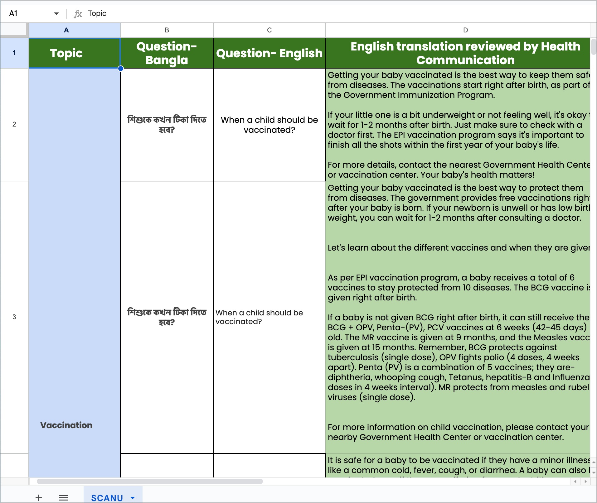

# Current State

<!--  -->

### FAQ Bank Search

Action: Before escalating the query, the MSE searches the medical archive to check if there is an existing answer to the user’s question. This step is crucial for efficient query resolution, reduced turn-around-time as well as minimizing escalations.

:::note

The image above is a screenshot from the medical archive which is used to search for existing answers. The most common challenges here are identifying the right entry. The MSE performs a search-and-retrieve by identifying subject keywords and then finding the right response. Owing to the overall time consumed to identify the right response, they sometimes provide a new response all over again. This adds redundancy into the medical archive.

:::

#### Outcome
If an answer is found, it’s prepared to be sent to the
  user. If not, the MSE proceeds to the next step.

#### Tools/Systems Used 
Internal FAQ bank or knowledge base.

### Translation and Escalation for Unanswered Questions

| Step    | Description |
| ----------- | ----------- |
| Initiation     | The Medical archive does not contain an answer |
| Translation request | The MSE raises a request to translate the query into a language that the doctor can understand |
| Doctor escalation| Once translated, the query is escalated to a doctor for a professional medical response. |
| Waiting for response | The MSE waits for the doctor’s response, monitoring the ticket status |
| Translation of doctor's response | Upon receiving a response, the MSE raises another request to translate the doctor’s response back into the user’s language. |

#### Outcome
The translated response is sent back to the user, resolving their query.

#### Tools/Systems Used
Translation services, doctor communication portal, and the ticketing system for tracking.

---
