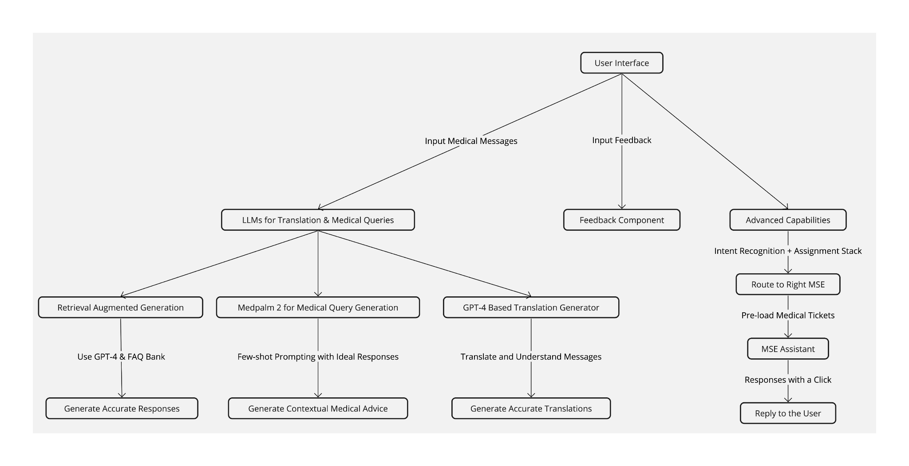
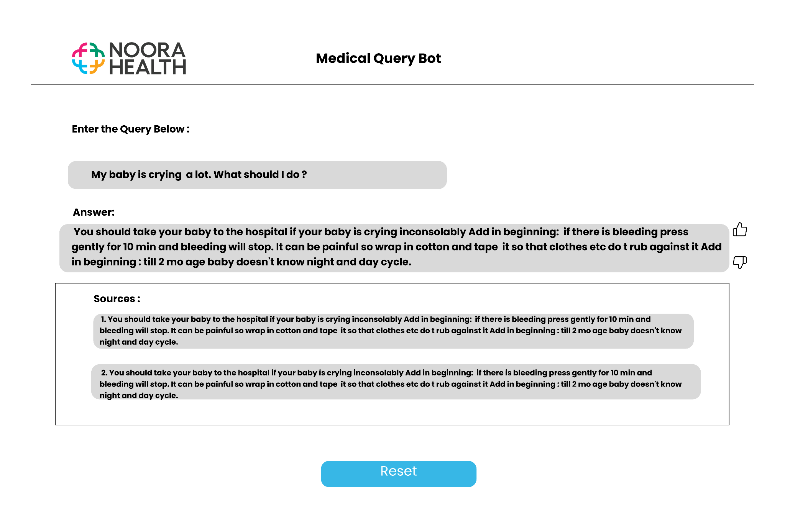
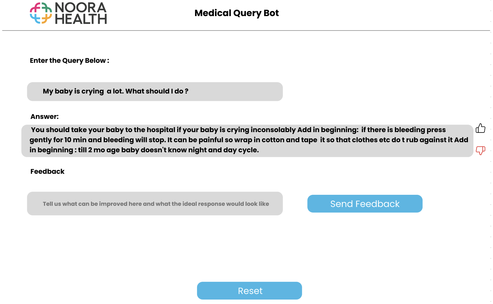

# Desired State

For the desired state, we envision The AI copilot assisting the MSE to perform a 4C (Consistent, Complete, Contextual and Correct) review.

### MSE Assistant:
Efficient Medical Query Resolution:

Rapid Response Mechanism: Ensure swift and effective resolution of
user medical queries.

Accelerated Translation Process:Ensure prompt and accurate
translations for both user queries and generated responses. (Achieved
through language-based routing system, which assigns queries to Medical
Support Executives (MSEs) who are proficient in the relevant languages,
thereby guaranteeing a seamless and efficient communication flow.)

### Enhancing User Experience by Minimizing Waiting Times:

- To improve the efficiency and user satisfaction during periods of
wait, implement a feature that automatically presents users with a
curated list of frequently asked questions and their corresponding
answers relevant to their medical inquiries.
- This proactive approach aims to provide immediate assistance and
potentially resolve queries even before a response is received from the
Medical Support Expert (MSE).If that answered their query, They can
close the chat with a button if that answered their query.

### Enhancing Query Processing

The goal is to develop a workflow that leverages a Large Language Model (LLM) to translate queries into English and accurately extract medical information from sources like medpalm2 or a validated medical question bank. This workflow includes:

- Generating an embedding from the cleaned Frequently Asked Questions (FAQ) database.
- Translating the user's query into English by:
  - Detecting the original language of the query and noting it as `{language}`.
  - If the query isn't in English, translating it into English; otherwise, processing the original message.

### Retrieving Medical Answers

- Using Retrieval-Augmented Generation (RAG) to provide a generated answer, showcasing the top three retrievals based on the translated query. If no relevant answer is found, the system will display "out of context."
- Utilizing Medpalm2 to obtain a precise answer to the medical query and translating this answer back into the user's language for clarity.

The system then translates the answer to the previously noted `{language}` and presents it to the user.

Priority Medium:

If the input and output languages are specified:

1. Utilize AI 4 Bharat's transliteration and translation APIs for conversion.

**Feedback Mechanism**

- **Interface:** Introduce a feedback mechanism post-answer with options for thumbs up (👍) or thumbs down (👎) and an optional text box for comments.
- **Process:** Store feedback with the query, its translation, and the response to analyze performance and make improvements.

  - Include a feature that allows users to specify their expected answer in a textbox when the response is insufficient or incorrect.

**Logging System**

- **Query Logging:** Document the original query, its detected language, and the translated query. Log both the original and translated responses.
- **Retrieval and Response:** Keep records of the top sources, the summarized answer, and its translation.

- **Feedback:** Record user feedback (rating and comments) alongside the related query and response.

