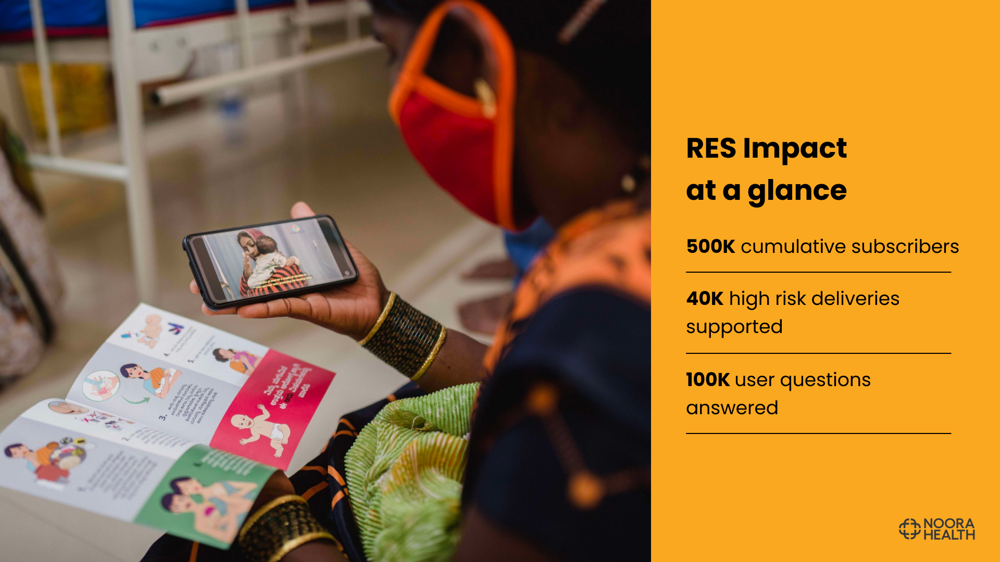

# Intro

This is a project by Noora Health. This has two main components: an intent-recognition system and an assistant platform for the medical support executives to provide health information to the patients/caregivers.

### What do we do?

RES is a mobile-based messaging service for patients and caregivers that empowers them towards healthy behaviors through in-time reminders and personalized support. RES is delivered through WhatsApp (scheduled messages, chatbot, and live chat), Voice (IVRS), or Teletrainers (live calls). We encourage patients and caregivers to ask us questions through these modalities and have a team of nurses and doctors to support this two-way communication platform.

### Key Features of RES

Snapshot of RES on WhatsApp
Live support: Patients and caregivers can engage and ask specific
questions on WhatsApp 7am-9pm, 6 days a week

Rich media: Messages include engaging text, visual aids, and short-
form videos to improve information retention through behavior change communication method©

Health topics: Messages include high-impact behaviors. (Including healthy practices and appropriate healthcare seeking that are customized to a user’s condition, stage, and need.)

Universal usage: All users irrespective of the technology they use (smartphone or basic phone) can access RES in their language and modality of preference

<!--  -->
