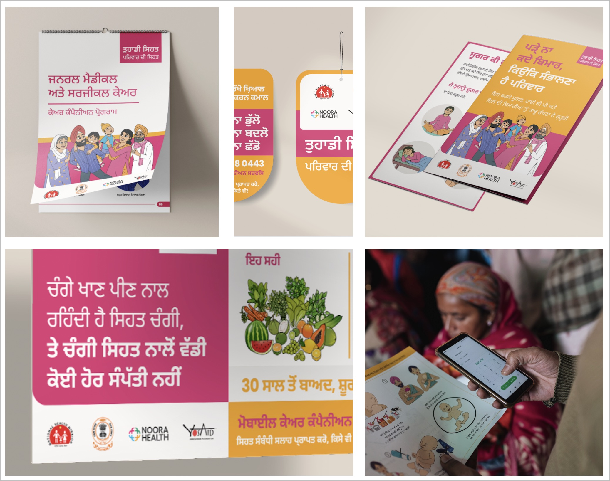

# Noora Health

Noora Health is committed to filling the critical gap in patient caregiver training and support, treating family members as indispensable caregivers and equipping them with essential skills. Our scalable program integrates with existing healthcare systems, delivering key care knowledge through in-person training sessions and mobile-based follow-up messaging. Active in India, Bangladesh, and Indonesia, Noora Health has educated over 8.4 million caregivers and collaborated with 1000+ health facilities, significantly decreasing complications and readmissions while enhancing care quality. 

### What do we do?

There is a significant divide in access to health information for patients in rural areas. Geographical isolation, inadequate infrastructure and shortage of public health workforce drastically restrict the reach and quality of health education provided to the patient caregivers.

RES aims  to serve as a health companion for patients and caregivers seeking health information. Through Whatsapp, we aim to bring expert medical guidance to patient’s fingertips. For guiding patient caregivers to take action on positive health behaviours, we aim to leverage generative AI to solve these key challenges

(a) Helping the medical support team (doctors, nurses) ensure the most important and urgent queries are answered first

(b) Identifying high-risk patients through their health queries and providing a high-touch campaign that could support them intensively during their patient journey

(c) Ensuring the health responses are consistent, complete, contextual and correct

### Key Features of RES

RES is a mobile-based messaging service for patients and caregivers that empowers them towards healthy behaviors through in-time reminders and personalized support.

RES is delivered through WhatsApp (scheduled messages, chatbot, and live chat), Voice (IVRS), or Teletrainers (live calls). We encourage patients and caregivers to ask us questions through these modalities and have a team of nurses and doctors to support this two-way communication platform.

Live support: Patients and caregivers can engage and ask specific
questions on WhatsApp 7am-9pm, 6 days a week

Rich media: Messages include engaging text, visual aids, and short-form videos to improve information retention through behavior change communication methods.

Health topics: Messages include high-impact behaviors. (Including healthy practices and appropriate healthcare seeking that are customized to a user’s condition, stage, and need)

Universal usage: All users irrespective of the technology they use (smartphone or basic phone) can access RES in their language and modality of preference.

### About the Project

> This website has two main components: a detailed documentation on two systems, (a) intent-recognition system and (b) an assistant platform for the medical support executives to provide health information for patient/caregivers.

<!--  -->
